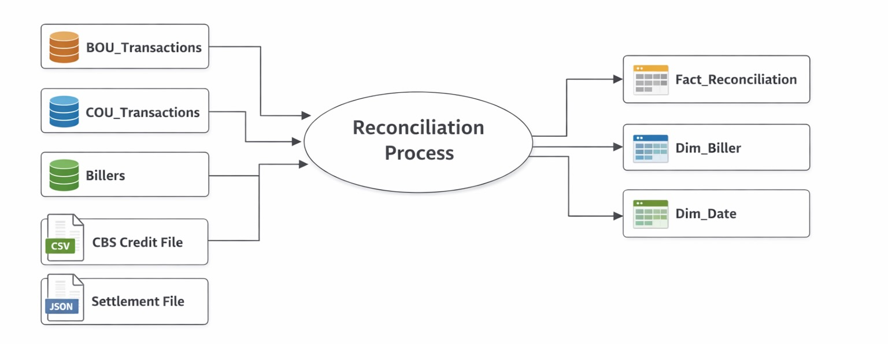

# Payments Reconciliation Lakehouse
An end-to-end data lakehouse project that processes payment transactions from multiple source systems, performs reconciliation using medallion architecture, and delivers reporting-ready data models. The solution includes incremental loading, late-arriving transaction handling, SCD Type 2  dimension management, and a star schema for analytics.

## Recon data flow

## Source System ERD

## Data Warehouse ERD

